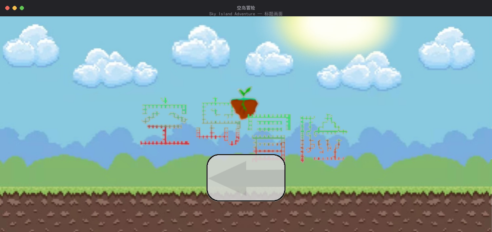
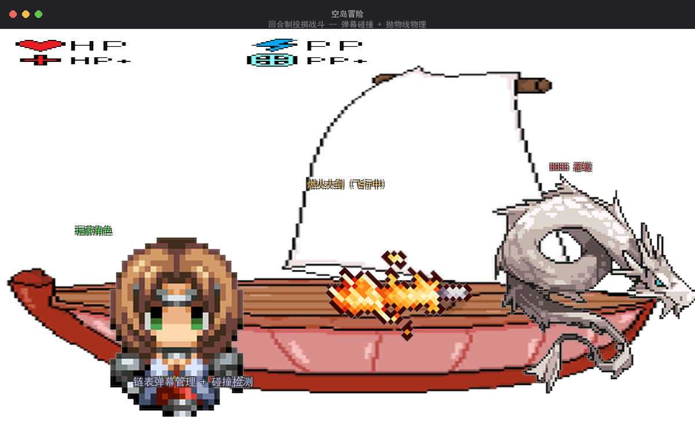
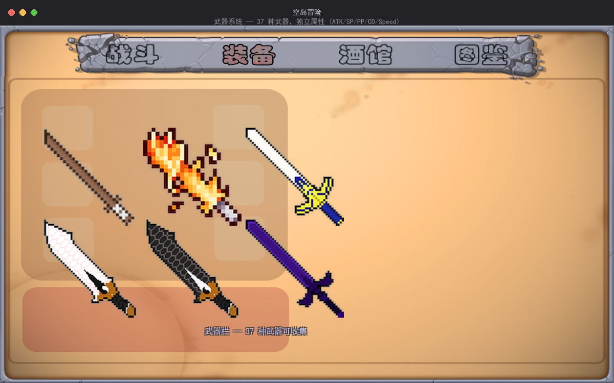
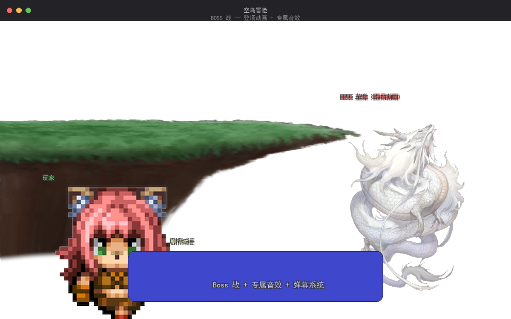
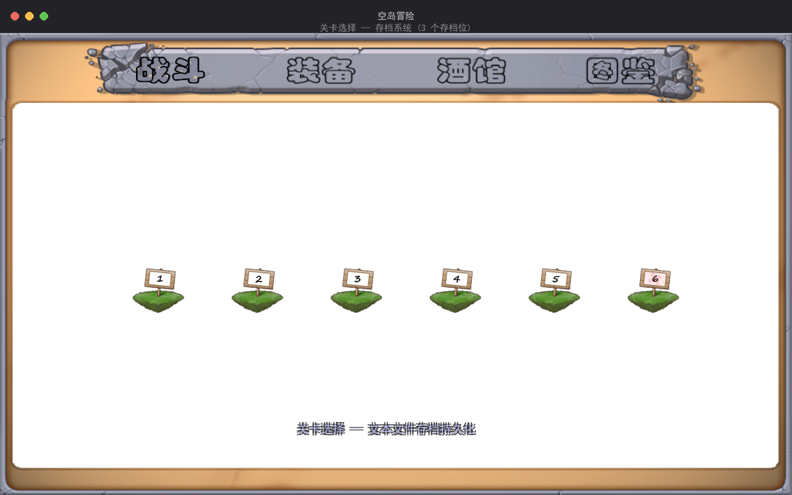

# 空岛冒险

> 一款基于 C++/C 语言 + EasyX 图形库开发的 2D 回合制投掷战斗游戏

## 项目简介
由本人刘文浩协助开发
空岛冒险是一款回合制投掷对战游戏（Turn-based Projectile Battle Game）。玩家通过投掷各种武器与敌人对战，每种武器拥有不同的攻击力、耐久度、旋转速度和冷却时间。游戏包含**存档系统、武器强化系统、商店交易、图鉴收集**等完整玩法。

灵感来源于《泰拉瑞亚》，玩法部分参考了《部落投石RPG2》等游戏。

## 技术栈

| 技术 | 说明 |
|------|------|
| **C 语言** | 纯 C 实现 |
| **EasyX** | Windows 图形库，用于渲染、图像处理、鼠标交互 |
| **Visual Studio** | 开发 IDE（VC++ 项目） |
| **WinMM** | Windows 多媒体 API，用于 BGM 和音效播放 |

## 技术亮点

- **数据结构**：使用单向链表管理飞行中的武器弹幕，支持动态增删节点
- **碰撞检测**：基于坐标的弹幕碰撞系统，含武器耐久度（SP）对抗机制
- **Alpha 混合渲染**：手写 PNG 透明通道混合算法，实现半透明贴图
- **物理模拟**：弹幕抛物线运动（重力加速度、初速度、旋转动画）
- **存档系统**：基于文本文件的游戏进度持久化（3 个存档位）
- **武器系统**：37 种武器，支持强化升级，每种有独立属性（ATK/SP/PP/CD/Speed）
- **Boss 战**：含 Boss 登场动画和专属音效

## 游戏截图

### 标题画面



### 回合制投掷战斗



> 玩家通过 Q/W/E/R 按键或鼠标点击投掷武器，弹幕以抛物线轨迹飞行。链表管理飞行中的武器节点，实时碰撞检测判断命中。

### 武器系统（37 种武器）



> 每种武器独立属性：ATK（攻击力）、SP（耐久度）、PP（穿透力）、CD（冷却时间）、Speed（飞行速度）。支持强化升级。

### BOSS 战



> Boss 登场含专属立绘动画和音效，战斗难度递增。玩家需根据 Boss 攻击模式选择合适的武器和投掷策略。

### 关卡选择 & 存档



> 基于文本文件的存档系统，支持 3 个存档位。关卡逐步解锁，进度持久化。

---

## 运行方式

### 环境要求

- Windows 操作系统
- Visual Studio（推荐 VS 2019/2022）
- [EasyX 图形库](https://easyx.cn/) 已安装

### 编译运行

1. 克隆本项目
2. 用 Visual Studio 打开 `空岛冒险/空岛冒险.vcxproj`（或 `.sln` 文件）
3. 确保 EasyX 已正确安装并配置
4. 选择 **Release** 配置，编译运行

> 注：项目中已包含编译好的 `Release/空岛冒险.exe`，可直接运行体验。

## 游戏操作

| 按键 | 功能 |
|------|------|
| `Q` | 武器 1 直线投掷（轨道 1） |
| `W` | 武器 1 抛物线投掷（轨道 2） |
| `E` | 武器 2 抛物线投掷（轨道 2） |
| `R` | 武器 2 抛物线投掷（轨道 3） |
| 鼠标点击按钮 | 对应武器槽投掷 |

## 项目结构

```
空岛冒险/
├── 空岛冒险/          # 主源码目录
│   ├── main.cpp       # 游戏主程序
│   └── resource.h     # 资源头文件
├── 武器贴图/          # 37 种武器 PNG 贴图
├── 光标/              # 自定义鼠标光标
├── 存档/              # 游戏存档文件
├── 背景/              # 背景图片资源
├── 角色&怪物贴图/     # 角色和怪物精灵
├── 音效/              # 游戏音效文件
├── 背景音乐/          # BGM 背景音乐
└── Release/           # 编译好的可执行文件
```

## 开发者

| 角色 | 姓名 |
|------|------|
| 主开发 | 包徐航 |
| 协助开发 | **刘文浩** |
| 指导老师 | 贺国平 |

## 声明

本项目为课程学习项目，其中部分图片素材来源于网络及《泰拉瑞亚》，非商业用途。如涉及版权问题请联系删除。

本人在项目中主要承担**学习与辅助开发**角色，在学长带领下参与代码阅读、调试与部分功能实现，通过本项目深入学习 C 语言编程、游戏循环架构、数据结构和图形渲染等知识。
